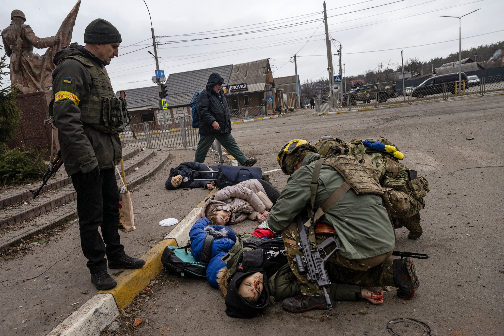

# Russian-Ukranian Conflict (NSFL)

## War Crimes

- Ukranian Father, Son, Dogs Murdered (Videos)

    - [Aftermath](ukranian-family-murdered-1-1.mp4)

    - [Video From Sons Phone](ukranian-family-murdered-1-1.mp4)

- [Ukranian Family of Four Shelled](http://web.archive.org/web/20220307005817/https://www.nytimes.com/2022/03/06/world/europe/ukrainian-family-killed-war.html)

    

## News/Propaganda/Counter-Propaganda

- [Pravda: Russian Troops to Move on Kyiv](https://www.pravda.com.ua/eng/news/2022/03/6/7328917/)

    а хіба вже багато днів вони не пробують те саме

        haven't they been trying the same thing for many days?

    Вони спробували напочатку і відсмоктали. Тепер вони київ майже не атакують, а захоплюють поряд території і підтягують додаткові сили.

        They tried in the beginning and sucked. Now they are hardly attacking Kyiv, but are seizing territory nearby and drawing up additional forces.

- [China demands control over Russian-Ukraine narrative, favors Russia](https://chinadigitaltimes.net/2022/02/minitrue-keep-weibo-posts-on-ukraine-favorable-to-russia-control-comments/)

    即刻起，乌克兰相关发微博。

    都用世面首发，大号再发，推世面，对俄不利、亲西方的不发。

    首发前给我看文案。

    评论进行精选控制，先开精选，然后把合适的评论放出来，要求谁发布谁负责。要真正去关注评论往外放。每条至少盯两天。注意交接。

    如果蹭话题，只用人新央的话题。

        Effective immediately, re: Weibo posts related to Ukraine

        Send all posts from the Horizon News account first, then repost from the main [Beijing News] account in order to promote Horizon. Do not post anything unfavorable to Russia or pro-Western.

        Let me look at drafts before publication.

        Carry out selection and control of comments: first enable selective comment display, then let suitable ones through. Everyone is responsible for the ones they publish. Pay real attention to which comments are allowed. Keep an eye on [responses to] each post for at least two days, paying attention at shift handovers.

        If using hashtags, only use those started by People’s Daily, Xinhua, or CCTV.

- [China sowing concern in Taiwanese nationals](https://www.axios.com/beijings-ukraine-censorship-35a02a04-91b2-4efb-8a91-a9d111a2a3a0.html#) (Conjectural)

- [Japan claims Kuril Islands as sovereign](https://www.republicworld.com/world-news/rest-of-the-world-news/japan-says-kuril-islands-primordially-japanese-russias-occupation-against-intl-order-articleshow.html)
